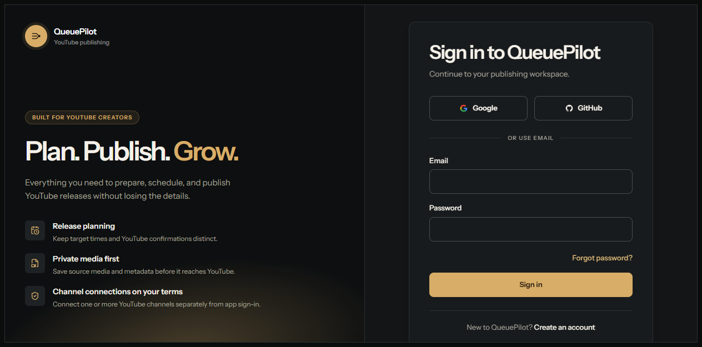
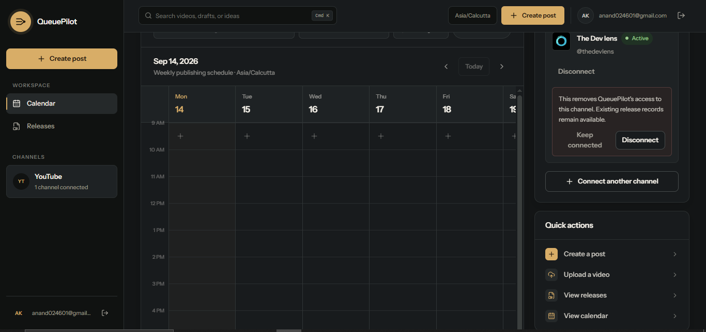
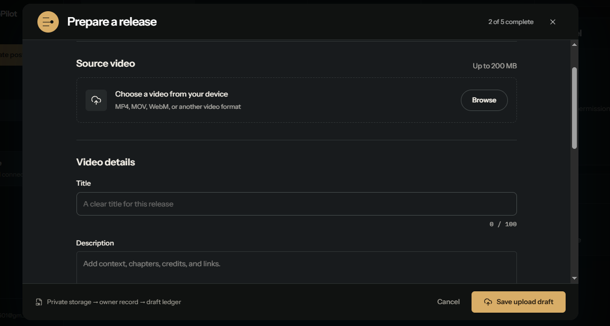
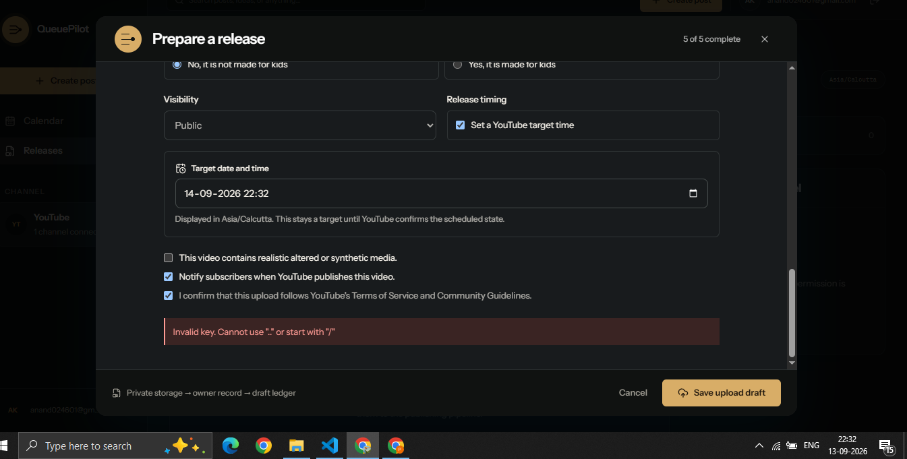

# QueuePilot

QueuePilot is a focused YouTube publishing workspace. It gives a creator one
place to prepare a release, keep source media private, schedule it for a
connected channel, and follow the real state reported by YouTube.

**Live demo:** [queuepilot.anandd.dev](https://queuepilot.anandd.dev)

### Sign in



### Publishing calendar



### Release preparation



### Schedule for YouTube



## What it does

- Sign in with email, Google, or GitHub.
- Connect more than one YouTube channel without mixing channel access with app login.
- Upload a video and optional custom thumbnail to private storage.
- Prepare metadata, audience settings, visibility, tags, and a target release time.
- Use Queue Pilot AI to suggest a topic angle, titles, description, tags, category, and thumbnail copy before applying any change.
- Queue the release for YouTube and see its real draft, transfer, scheduled, published, or failed state.
- Browse releases in a filterable list or weekly publishing calendar.

QueuePilot does not show made-up metrics or pretend a release is scheduled
before YouTube confirms it.

## Quick look

Open the [live app](https://queuepilot.anandd.dev), sign in, connect a YouTube
channel, then create or schedule a release from the workspace.

## Built with

- React, TypeScript, Vite, and Tailwind CSS
- InsForge for authentication, Postgres, private storage, edge functions, and schedules
- TanStack Query for server state
- YouTube Data API for channel access, resumable uploads, and release status

## Run locally

```bash
npm install
Copy-Item .env.example .env.local
npm run dev
```

Add your InsForge URL and public anonymous key to `.env.local`. Keep all admin
keys, OAuth client secrets, refresh tokens, and browser auth-state files out of
Git.

Useful checks:

```bash
npm run guard:queuepilot
npm run lint
npm test
npm run build
```

## AI metadata setup

The browser never receives the Gemini credential. The deployed
`youtube-metadata-assistant` InsForge function reads `GEMINI_API_KEY` from the
project's encrypted server secrets and defaults to the stable
`gemini-3.8-flash` model. Set `GEMINI_MODEL` only when deliberately pinning a
different model. The database enforces per-user hourly and daily request
limits, and generated metadata is not stored until the creator applies it.

## How publishing works

1. The browser stores video files in a private, owner-scoped bucket.
2. The app creates a release record and submits it to the server-owned YouTube queue.
3. InsForge workers transfer the video with YouTube's resumable upload protocol.
4. QueuePilot reconciles the YouTube response and updates the release state.

Google and GitHub app login are separate from the YouTube OAuth permission.
YouTube tokens are encrypted and remain server-side.

## Project structure

```text
src/           React application
functions/     InsForge edge functions and workers
migrations/    Database schema and publishing lifecycle
public/        Public app assets
docs/media/    README screenshots
```

## Current limit

The deployed InsForge storage path accepts source videos up to **200 MB**. The
interface enforces and communicates that limit.
